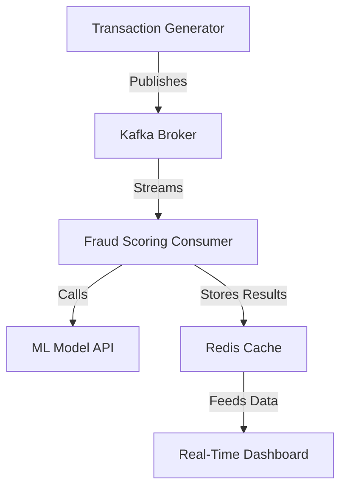

# Real-Time Fraud Detection System

A fully containerized real-time fraud detection system built with`Kafka`, `XGBoost`, `Redis`, `FastAPI`, and `Docker`. The pipeline generates synthetic financial transactions, processes them through a machine learning model for fraud scoring, stores results in Redis, and visualizes suspicious activity on a live dashboard — demonstrating a production-like system for financial transaction monitoring.

---

## Features

- **Data Generation**: Streams realistic synthetic transactions using `Faker`.
- **Exploratory Analysis**: Analyzes transaction behavior to design features.
- **Model Training**: Trains an `XGBoost` classifier with cross-validation and grid search.
- **Model Serving**: Serves the trained model via `FastAPI` for real-time scoring.
- **Streaming Pipeline**: Uses `Kafka` for event flow; producer simulates transactions, consumer scores them.
- **Caching Layer**: `Redis` stores enriched results for the dashboard.
- **Dashboard**: Live UI highlights suspected fraud.
- **Containerized Deployment**: All components run in containers via `Docker Compose`.

---

## Architecture



---

## Tech Stack

- **ML & Data**: Python, Pandas, Scikit-learn, XGBoost
- **Streaming & Serving**: Kafka, FastAPI
- **Storage**: Redis
- **Dashboard**: HTML, CSS, JS (served with FastAPI)
- **Infrastructure**: Docker & Docker Compose

---

## Results

**Model performance on synthetic data:**

- **Recall (fraud):** `0.85`
- **Precision (fraud):** `0.74`
- **F1-score:** `0.79`
- **Accuracy:** `0.98`

The model catches most fraud while keeping false alarms relatively low.

**Transactions Latency:**

- Average end-to-end pipeline latency: **~35 ms**
- Model inference latency measured via API requests

---

## Screenshots

### Dashboard and Kafka


---

## Getting Started

### Prerequisites

- Docker & Docker Compose installed
- Git

#### Clone the repository

```bash
git clone https://github.com/PablooDario/Real-Time-Fraud-Detector.git
cd Real-Time-Fraud-Detector
```

#### Build and Run

```bash
docker compose up -d --build
```

#### Open the Services

```bash
- Model API docs: http://localhost:8000/docs
- Dashboard: http://localhost:8501
```