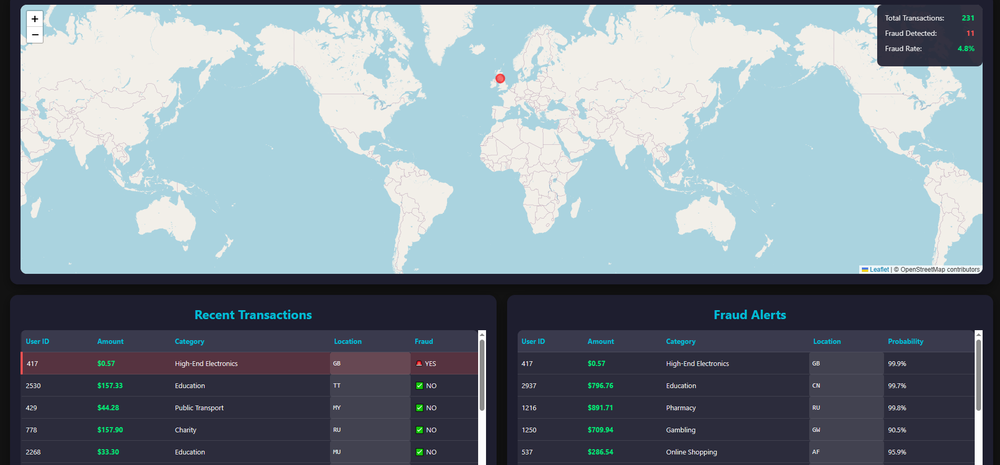
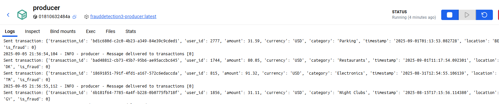
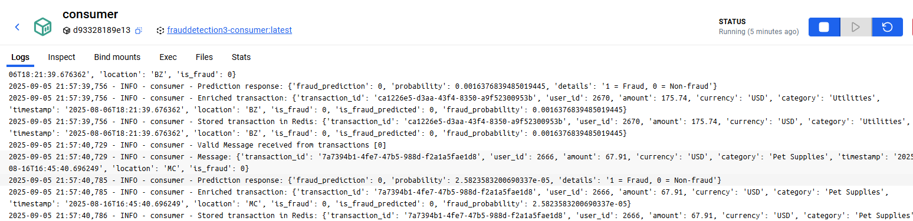

# Real-Time Fraud Detection System

This project is a fully containerized real-time fraud detection pipeline built with `Kafka`, `XGBoost`, `Redis`, `FastAPI`, and `Docker`.
It simulates financial transactions, scores them for fraud in real time, and displays suspicious activity on a live dashboard.

---

## What It Does

- **Data generation** – Use `Faker` to stream realistic synthetic transactions.
- **Exploratory analysis** – Analyze transaction behavior to design useful features.
- **Model training** – Train an `XGBoost` classifier with cross-validation and grid search.
- **Model serving** – Expose the trained model via `FastAPI` for real-time scoring.
- **Streaming pipeline** – `Kafka` handles event flow: producer simulates transactions, consumer scores them on the fly.
- **Caching layer** – `Redis` keeps enriched results available for the dashboard.
- **Dashboard** – A live UI shows global transactions, highlighting suspected fraud.
- **Deployment** – Everything runs in containers with `Docker Compose`.

                                                                         
---

## Tech Used

- **ML & Data**: Python, Pandas, Scikit-learn, XGBoost  
- **Streaming & Serving**: Kafka, FastAPI, ONNX Runtime  
- **Storage**: Redis  
- **Dashboard**: HTML, CSS, JS (served with FastAPI)  
- **Infrastructure**: Docker & Docker Compose  

---

## Results

Model performance On synthetic data:

- Recall (fraud): `0.85`  
- Precision (fraud): `0.74`  
- F1-score: `0.79`  
- Accuracy: `0.98`  

So the model catches most fraud while keeping false alarms relatively low.

Transactions Latency

- Average end-to-end pipeline latency: **~35 ms**  
- Model inference latency measured via API requests  

### Dashboard and Kafka 




## Run It Yourself

Clone the repo:

```bash
git clone https://github.com/yourusername/fraud-detection.git
cd fraud-detection
```

Open the services:

```bash
Model API docs → http://localhost:8000/docs
Dashboard → http://localhost:8501
```